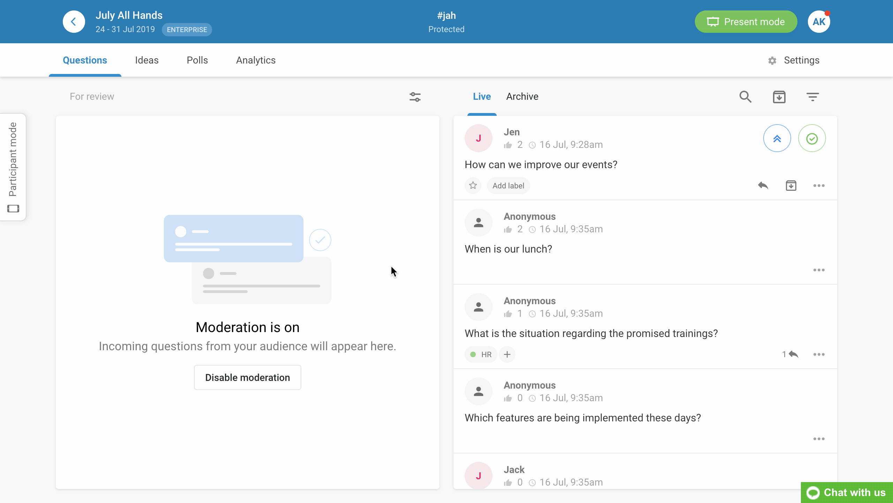
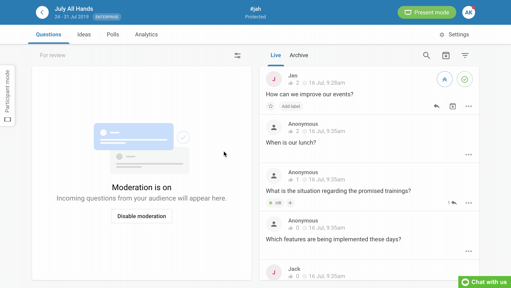

## O QUE É SLI.DO. 

Sli.do é uma plataforma de perguntas, respostas e pesquisas. Ele permite uma interação entre professores e alunos, tirando assim o máximo proveito das reuniões, aulas e eventos.

O sli.do é uma ferramenta muito legal, ela permite formular perguntas que são colocadas de maneira sequencial, é interessante também que nele existe uma votação via likes possibilitando assim as perguntas que os participantes julgarem mais interessantes "fure a fila" passando a ser a primeira. Há também uma funcionalidade de pesquisas. O professor ou responsável pelo chat cria uma pesquisa , e os participantes reagem via votação, acompanhando tudo em tempo real, vizualizando assim o gráfico se mechendo na tela com sua porcentagem.

### Como utilizar o Sli.do.

1. Acesse o site https://www.sli.do/ 
2. Insira um código para entrar na sala.
3. Faça perguntas e interaja.

### Sli.do veio para ficar.

Além de ser uma ferramenta grátis, ele permite que o usuário identifique-se ou não. Isso mesmo também aceita o anonimato.

https://www.capterra.com.br/software/154051/slido
